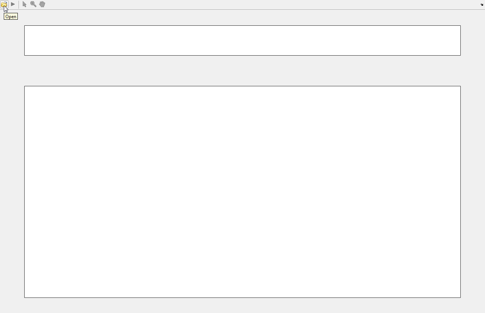
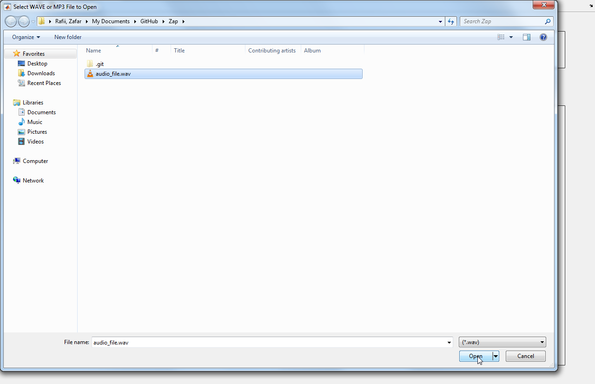
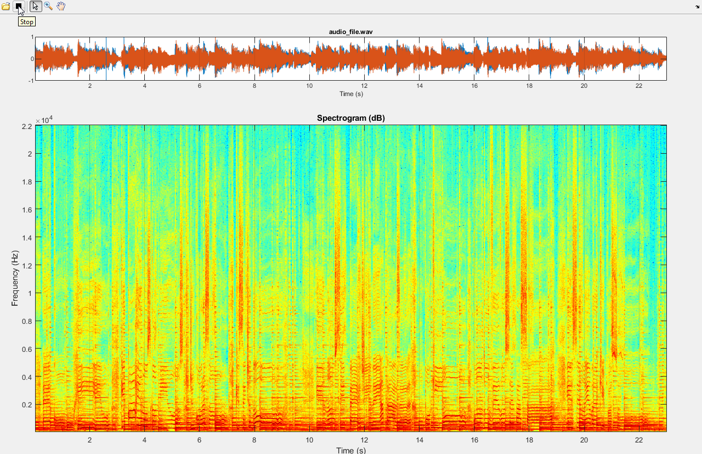
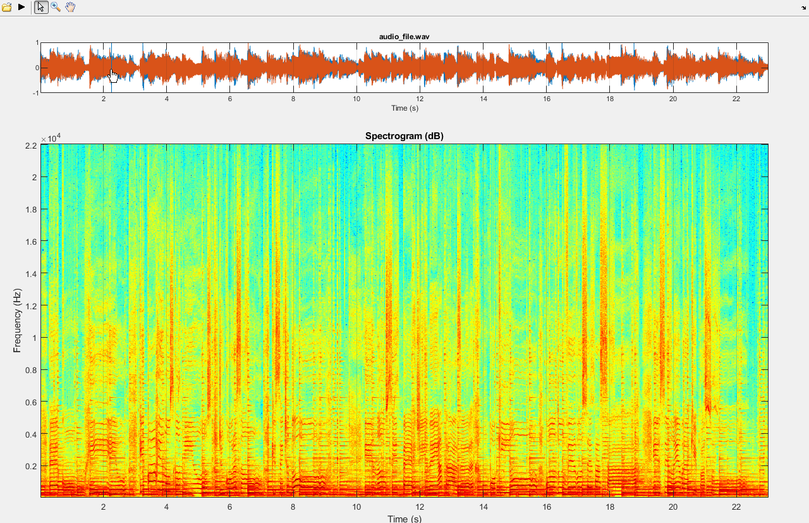
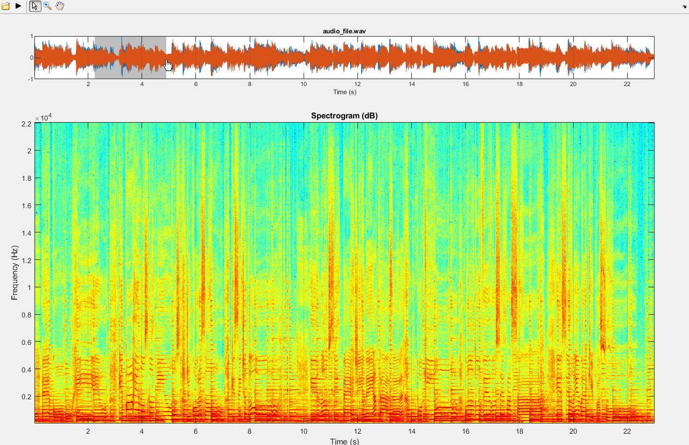
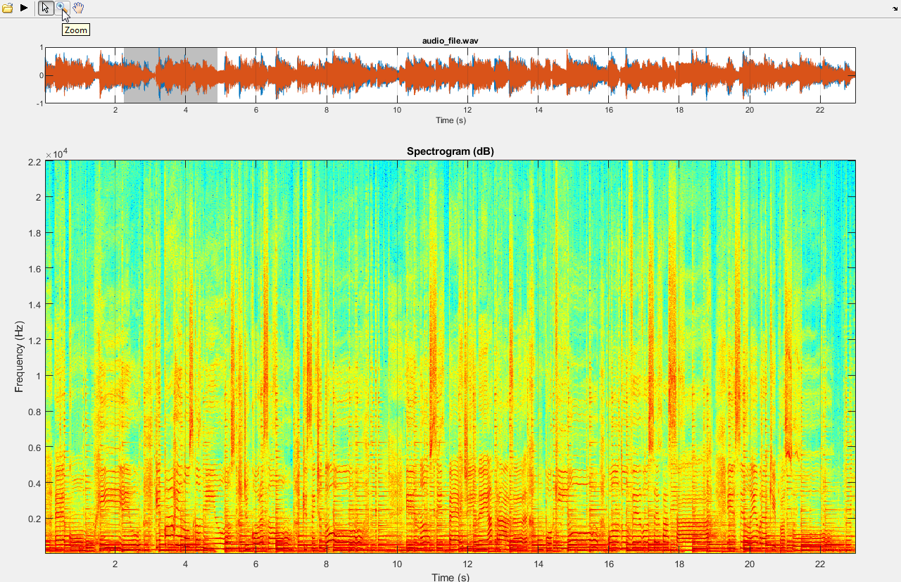
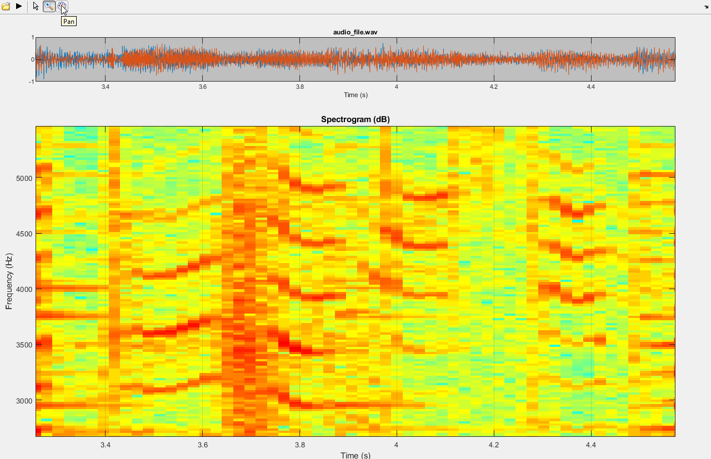
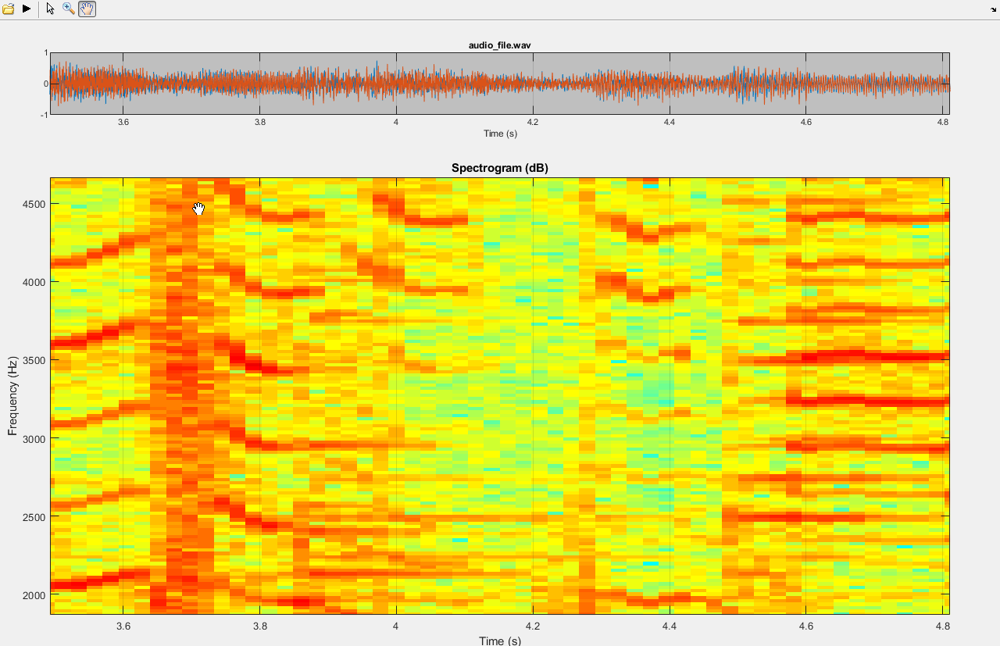

# Zap (Zafar's audio player)

This repository contains a Matlab GUI which implements Zafar's audio player (Zap), featuring some practical functionalities such as a synchronized spectrogram, a select/drag tool, and a playback line.

- [zap Matlab GUI](#zap-matlab-gui)
- [audio_file](#audio_file)
- [Author](#author)

## zap Matlab GUI

- [Open](#open)
- [Play/Stop](#playstop)
- [Select/Drag](#selectdrag)
- [Zoom](#zoom)
- [Pan](#pan)

### Open

### Play/Stop

### Select/Drag

### Zoom

### Pan

## audio_file

- Tamy - Que Pena / Tanto Faz (excerpt)

## Author

- Zafar Rafii
- zafarrafii@gmail.com
- [Website](http://zafarrafii.com/)
- [CV](http://zafarrafii.com/Zafar%20Rafii%20-%20C.V..pdf)
- [Google Scholar](https://scholar.google.com/citations?user=8wbS2EsAAAAJ&hl=en)
- [LinkedIn](https://www.linkedin.com/in/zafarrafii/)
