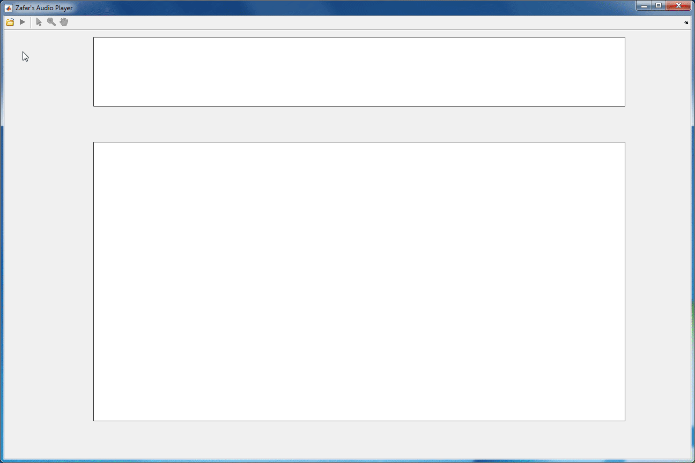

# Zap (Zafar's audio player)

This repository contains a Matlab GUI which implements Zafar's audio player (Zap), featuring some practical functionalities such as a synchronized spectrogram, a select/drag tool, and a playback line.

- [zap Matlab GUI](#zap-matlab-gui)
- [audio_file](#audio_file)
- [Author](#author)

## zap Matlab GUI

Zap implements a simple audio player as a Matlab programmatic GUI. The user can open a WAV or MP3 file, play/stop the audio, select/drag a region to play, and zoom and pan on the axes. The code is self-explanatory, heavily commented, and fully modular. Parts of the code can be helpful for other GUIs, especially the `playaudiotool` function which displays a playback line as the playback is in progress and the `selectaudiotool` function which allows the user to create a selection line or region on the audio to play.

Toolbar's toggle buttons:

- [Open](#open)
- [Play/Stop](#playstop)
- [Select/Drag](#selectdrag)
- [Zoom](#zoom)
- [Pan](#pan)

### Open

- Select a WAVE or MP3 to open (the audio can be multichannel).
- Display the audio signal and the audio spectrogram (in dB); the horizontal limits of the signal and spectrogram axes will be synchronized (and will stay synchronized if a zoom or pan is applied on any of the axes).

### Play/Stop

- Play the audio if the playback is not in progress; stop the audio if the playback is in progress; a playback line will be displayed as the playback is in progress.
- If there is no selection line or region, the audio will be played from the start to the end; if there is a selection line, the audio will be played from the selection line to the end of the audio; if there is a selection region, the audio will be played from the start to the end of the selection region.

### Select/Drag

- If a left mouse click is done on the signal axes, a selection line is created; the audio will be played from the selection line to the end of the audio.
- If a left mouse click and drag is done on the signal axes or on a selection line, a selection region is created; the audio will be played from the start to the end of the selection region.
- If a left mouse click and drag is done on the left or right boundary of a selection region, the selection region is resized.
- If a right mouse click is done on the signal axes, any selection line or region is removed.

### Zoom

- Turn zooming on or off or magnify by factor (see https://mathworks.com/help/matlab/ref/zoom.html)

- If used on the signal axes, zoom horizontally only; the horizontal limits of the signal and spectrogram axes will stay synchronized.

### Pan

- Pan view of graph interactively (see https://www.mathworks.com/help/matlab/ref/pan.html)

- If used on the signal axes, pan horizontally only; the horizontal limits of the signal and spectrogram axes will stay synchronized.

## audio_file

- Tamy - Que Pena / Tanto Faz (excerpt)

## Author

- Zafar Rafii
- zafarrafii@gmail.com
- [Website](http://zafarrafii.com/)
- [CV](http://zafarrafii.com/Zafar%20Rafii%20-%20C.V..pdf)
- [Google Scholar](https://scholar.google.com/citations?user=8wbS2EsAAAAJ&hl=en)
- [LinkedIn](https://www.linkedin.com/in/zafarrafii/)
