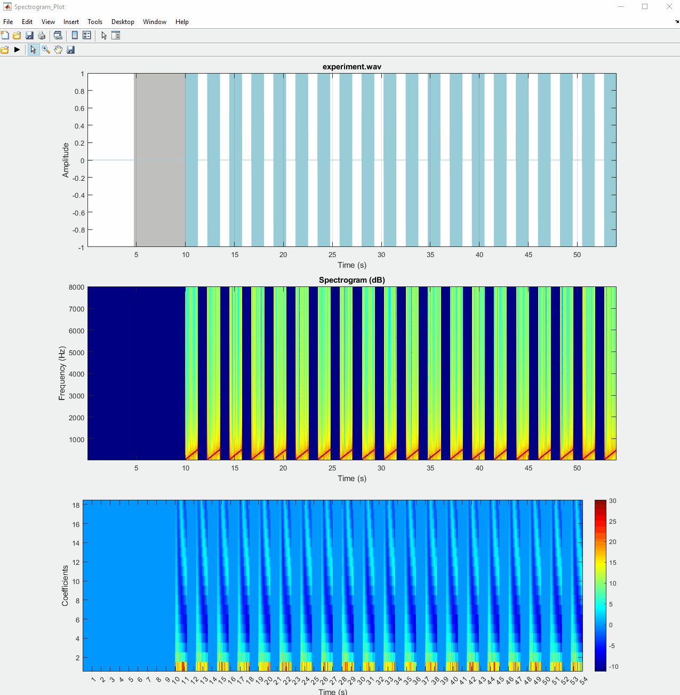
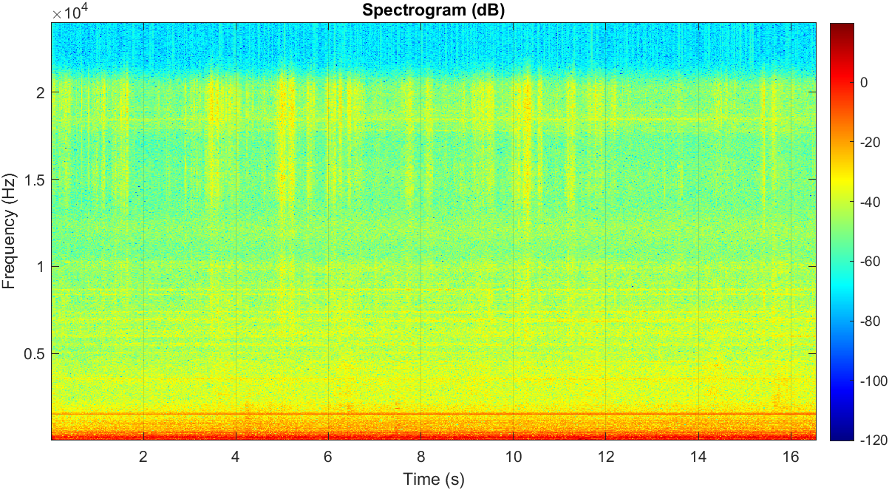
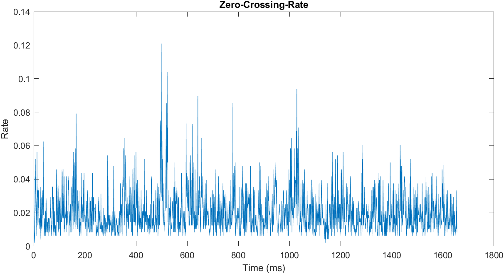
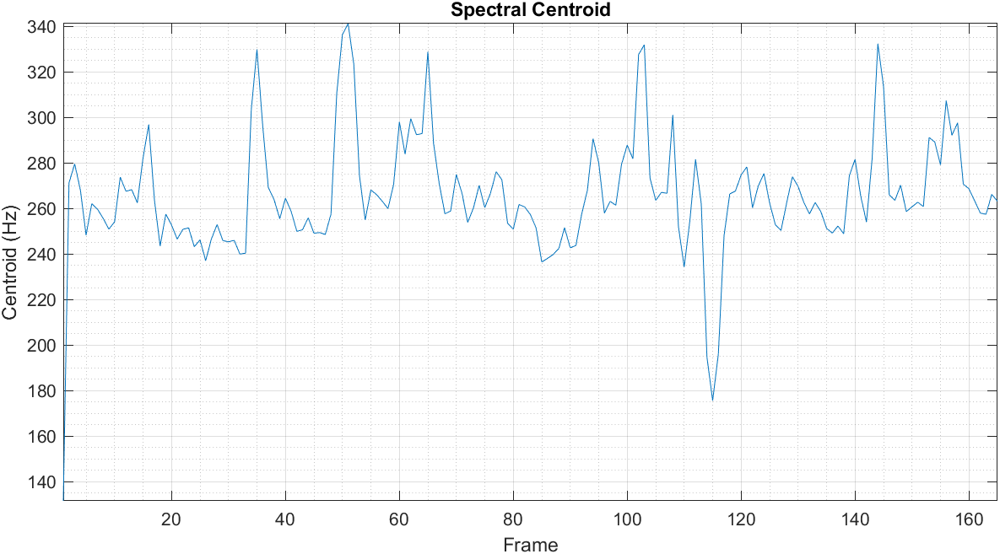
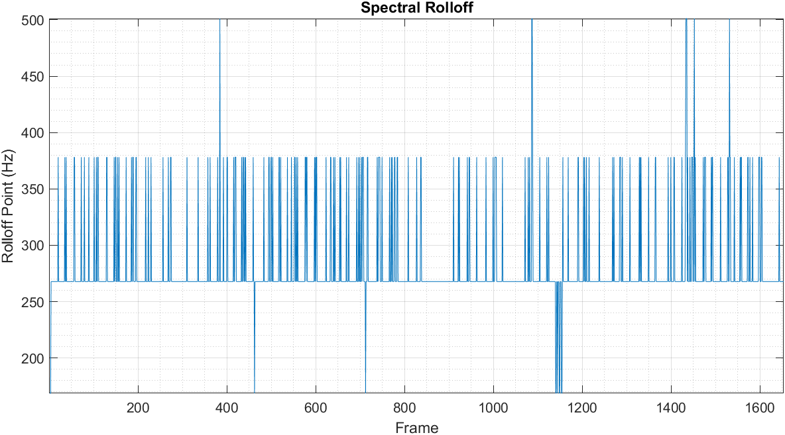
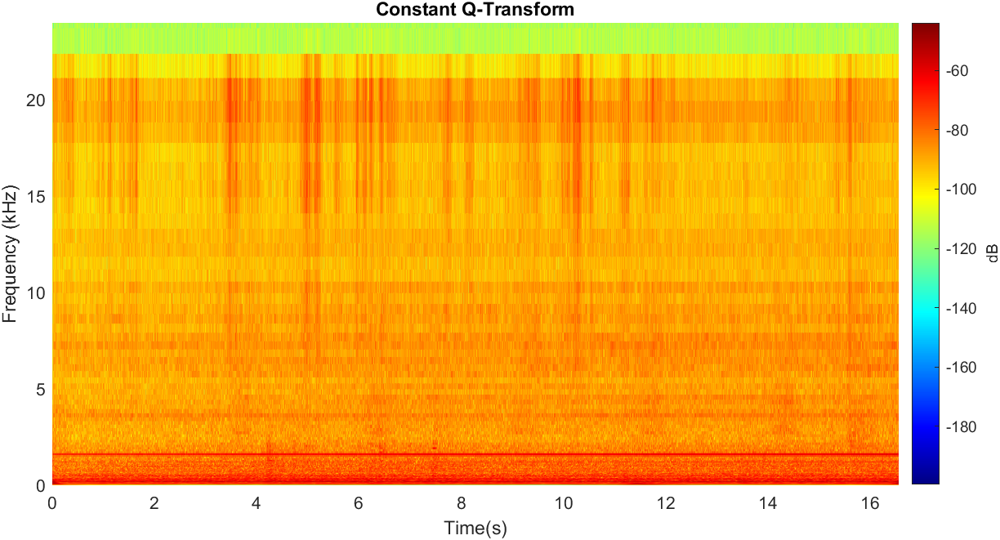

# Spectrogram_Plot-Matlab

Matlab GUI which implements Zafar's audio player (Spectrogram_Plot), featuring some practical functionalities such as a playback line, a select/drag tool, and a synchronized spectrogram.

Files:
- [`Spectrogram_Plot.m`](#Spectrogram_Plotm): Matlab GUI which implements Spectrogram_Plot.
- [`audio_file.wav`](#audio_filewav): audio file used for the examples.

[`Features`](#Features): Different features.

## Spectrogram_Plot.m

Spectrogram_Plot implements a simple audio player as a Matlab programmatic GUI. The user can open a WAV or MP3 file, play/stop the audio, select/drag a region to play, zoom, pan and save on the axes. The code is self-explanatory, heavily commented, and fully modular. Parts of the code can be helpful for other GUIs, especially the `playtool` function which displays a playback line as the playback is in progress and the `selecttool` function which allows the user to create a selection line or region on the audio to play.

Functionalities:

- [Open](#open)
- [Play/Stop](#playstop)
- [Select/Drag](#selectdrag)
- [Zoom](#zoom)
- [Pan](#pan)
- [Save](#save)

### Open

- Select a WAVE or MP3 to open; the audio can be mono or stereo.
- Display the audio signal and the audio spectrogram; the x-axis limits of the signal axes and the spectrogram axes will be synchronized (and will stay synchronized if a zoom or pan is applied on one of them).

### Play/Stop

- Play the audio if the playback is not in progress; stop the audio if the playback is in progress; a playback line will be displayed as the playback is in progress.
- If there is no selection line or region, the audio will be played from the start to the end; if there is a selection line, the audio will be played from the selection line to the end of the audio; if there is a selection region, the audio will be played from the start to the end of the selection region.
- Pressing the space key will also play and stop the audio.

### Select/Drag

- If a left mouse click is done on the signal axes, a selection line is created; the audio will be played from the selection line to the end of the audio.
- If a left mouse click and drag is done on the signal axes or on a selection line, a selection region is created; the audio will be played from the start to the end of the selection region.
- If a left mouse click and drag is done on the left or right boundary of a selection region, the selection region is resized.
- If a right mouse click is done on the signal axes, any selection line or region is removed.

### Zoom

- Turn zooming on or off or magnify by factor (see https://mathworks.com/help/matlab/ref/zoom.html)
- If used on the signal axes, zoom horizontally only; the x-axis limits of the signal axes and the spectrogram axes will stay synchronized.

### Pan

- Pan view of graph interactively (see https://www.mathworks.com/help/matlab/ref/pan.html)
- If used on the signal axes, pan horizontally only; the x-axis limits of the signal axes and the spectrogram axes will stay synchronized.

### Save

- save view of graph (see https://www.mathworks.com/help/matlab/ref/imwrite.html)
- Save the figure above and then save the figure below.

## audio_file.wav

23 second audio excerpt from the song *Que Pena Tanto Faz* performed by *Tamy*.

# Featrues

# Author

- Zijie Tang
- zijietang0316@gmail.com
- [GitHub](https://github.com/zijietang0316)
- [LinkedIn](https://www.linkedin.com/in/zijie-tang-4ba81b240/)
